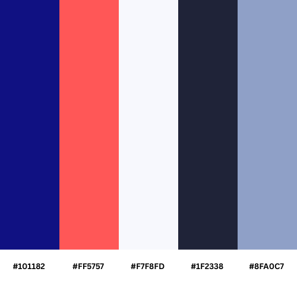

# Branding

### Color Palette

## **1. Brand Color System**

### **Primary Colors**

| **Name** | **Hex** | **Role** |
| --- | --- | --- |
| **Deep Indigo** | #101182 | Core brand anchor, authority, trust |
| **Vibrant Coral** | #FF5757 | Action, energy, conversion |

### **Secondary & Support Colors**

| **Name** | **Hex** | **Role** |
| --- | --- | --- |
| **Soft Blush** | #FF9A8F | Hover, active, subtle emphasis |
| **Mist White** | #F7F8FD | Primary background, cards |
| **Slate Ink** | #1F2338 | Headings, primary text |
| **Cool Steel** | #8FA0C7 | Borders, dividers, tertiary text |

## **2. Color Hierarchy (Non-Negotiable)**

1. **Deep Indigo** dominates the brand
2. **Vibrant Coral** appears only where action is required
3. **Soft Blush** is never used standalone
4. **Mist White** keeps the system breathable
5. **Slate Ink** ensures readability
6. **Cool Steel** supports, never leads

This hierarchy protects brand maturity as you scale.

## **3. Logo Usage**

### **Approved Logo Color Combinations**

- Deep Indigo logo on Mist White
- Deep Indigo + Vibrant Coral wordmark
- White logo on Deep Indigo background

### **Logo Color Rules**

- Never use Soft Blush inside the logo
- Never place logo on Vibrant Coral background
- Maintain clear space = height of “B” in BiggMate

## **4. Background Usage**

### **Primary Backgrounds**

- **Mist White** → default UI, landing pages, dashboards
- **Deep Indigo** → hero sections, footers, premium blocks

### **Gradient Rule (Optional, Premium Use)**

- #101182 → #1F2338
    
    Use only for hero sections or app splash screens.
    

## **5. Typography Color Rules**

### **Headings**

- **Slate Ink** on light backgrounds
- **White (#FFFFFF)** on deep indigo backgrounds

### **Body Text**

- **Slate Ink** for primary content
- **Cool Steel** for helper text, metadata

### **Disabled / Low Emphasis**

- Cool Steel at 60% opacity only

## **6. Button & Action System**

### **Primary Button**

- Background: **Vibrant Coral** #FF5757
- Text: White
- Hover: **Soft Blush** #FF9A8F
- Active: Soft Blush at 90% opacity

### **Secondary Button**

- Border: **Deep Indigo**
- Text: **Deep Indigo**
- Background: Transparent
- Hover: Deep Indigo (5–8% opacity fill)

### **Destructive / Critical**

- Use Vibrant Coral only
- No additional red shades allowed

## **7. Cards, Borders & Dividers**

- Card background: **Mist White**
- Card border: **Cool Steel** at 20–30% opacity
- Divider lines: Cool Steel at 15% opacity
- Elevated cards: subtle shadow, no color glow

## **8. Accessibility & Contrast**

- Minimum contrast ratio: **4.5:1** for body text
- Coral is never used for long-form text
- Indigo + white is the default high-contrast pair

### **9. Emotional Tone Mapping**

| **Color** | **Emotion** |
| --- | --- |
| Deep Indigo | Trust, clarity, seriousness |
| Vibrant Coral | Action, connection, momentum |
| Soft Blush | Warm feedback, human touch |
| Mist White | Calm, space, focus |
| Slate Ink | Intelligence, confidence |
| Cool Steel | Balance, restraint |

## **10. Brand Guardrails (Important)**

**Always**

- Think calm, confident, human
- Let white space breathe
- Use coral intentionally

**Never**

- Add new brand colors casually
- Overuse coral
- Use gradients in core UI
- Mix warm & cool accents randomly

## **11. Font Stack Decision (Locked)**

### **Primary Typeface — Inter**

**Usage:** UI, product, dashboards, landing pages, internal tools

**Why Inter wins**

- Designed for screens (not adapted later)
- Excellent at small sizes
- Neutral but premium
- Best-in-class number glyphs
- Used by Linear, Stripe, Notion, GitHub

**Weights to load (only these):**

- 400 (Regular)
- 500 (Medium)
- 600 (SemiBold)
- 700 (Bold)

No italics unless absolutely required.

### **Secondary Typeface — Satoshi**

**Usage:** Brand headlines, marketing pages, hero sections, campaigns

**Why Satoshi**

- Human warmth without being childish
- Modern, geometric, confident
- Pairs beautifully with Inter
- Feels “founder-first”, not enterprise-first

**Weights to load:**

- 500 (Medium)
- 700 (Bold)

## **12. Typographic Hierarchy**

### **Headings (Marketing / Brand Pages)**

**Font:** Satoshi

**Color:** Slate Ink / White (on indigo)

| **Level** | **Size** | **Weight** | **Line Height** |
| --- | --- | --- | --- |
| H1 | 56–64px | 700 | 1.1 |
| H2 | 40–48px | 700 | 1.15 |
| H3 | 28–32px | 600 | 1.2 |

### **Headings (Product / App)**

**Font:** Inter

**Weight:** 600 only

| **Level** | **Size** | **Line Height** |
| --- | --- | --- |
| Section Title | 20–24px | 1.3 |
| Card Title | 16–18px | 1.35 |

### **Body Text**

**Font:** Inter

**Weight:** 400 / 500

| **Type** | **Size** | **Line Height** | **Color** |
| --- | --- | --- | --- |
| Primary | 15–16px | 1.6 | Slate Ink |
| Secondary | 14px | 1.6 | Cool Steel |
| Caption | 12–13px | 1.5 | Cool Steel |

## **13. Buttons & CTAs**

- **Font:** Inter
- **Weight:** 600
- **Letter spacing:** 0.2px
- **Case:** Sentence case only

## **14. Numbers, Metrics & Data**

- Always use **Inter**
- Use **tabular numbers** where supported
- Weight: 500 or 600 only
- Color: Slate Ink or Deep Indigo

This matters for dashboards and match stats.

## **15. Line Length & Readability Rules**

- Ideal line length: **60–75 characters**
- Avoid full-width paragraphs
- Max paragraph width: **640px**

This is what separates premium UX from average.

## **16. Spacing & Rhythm (Typography + Layout)**

- Base unit: **8px system**
- Vertical rhythm:
    - Heading → body: 16–24px
    - Paragraph spacing: 12–16px
- No random spacing adjustments

## **17. Brand Guardrails (Typography)**

**Always**

- Use font weight to create hierarchy, not colors
- Prefer Medium over Bold when in doubt
- Let white space do the heavy lifting

**Never**

- Mix more than 2 font families
- Use decorative fonts
- Stretch, skew, or outline text
- Use emojis inside product UI text