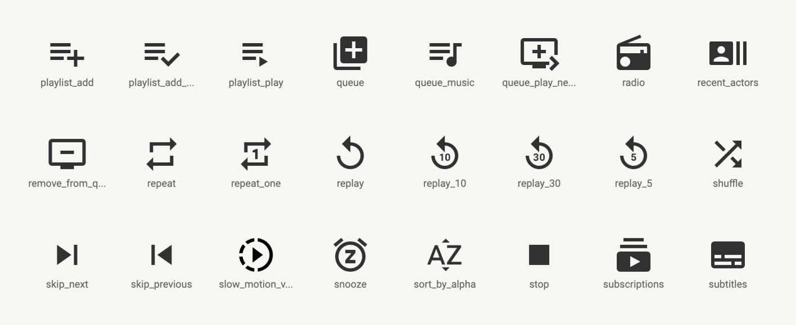
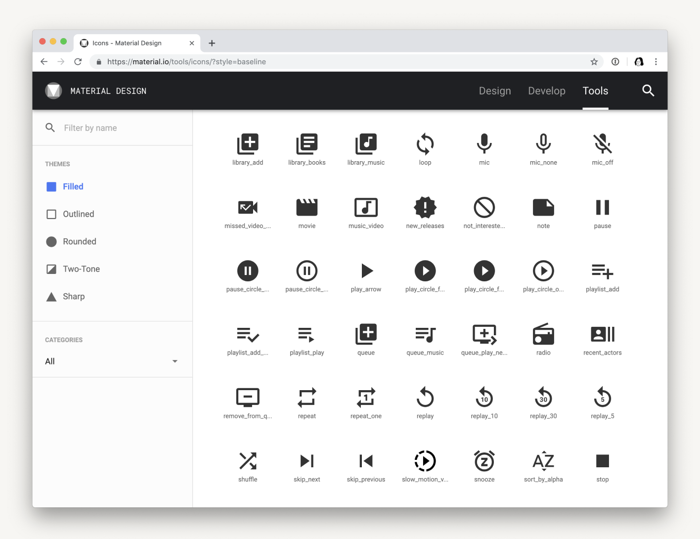

# Icons

Created: May 18, 2025 2:42 PM
Last Updated: May 18, 2025 2:42 PM
Owners: Shawn Sanchez
Status: Current 👍

<aside>
💡 This is sample content that you can replace with your own.

</aside>

# Material Design Icons

We source the majority of our UI icons from Google's [Material Design](https://material.io/tools/icons/?style=baseline). This helps us move quickly and maintain visual consistency.

[Icons - Material Design](https://material.io/tools/icons/)

## **Guidelines**

- Always use the "filled" theme
- Use SVGs instead of raster images

