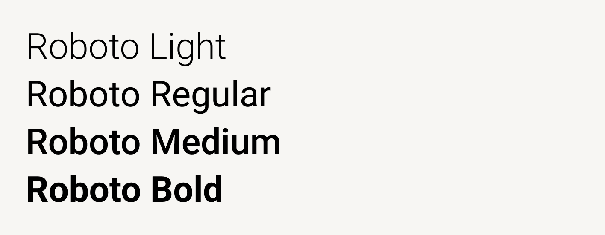
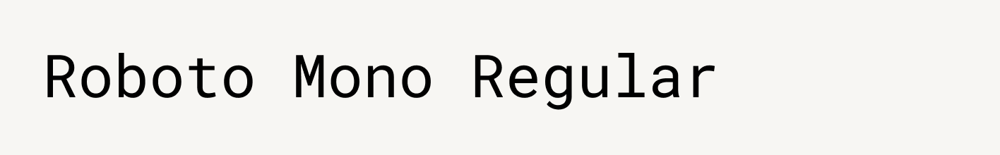

# Typography

Created: May 18, 2025 2:42 PM
Last Updated: May 18, 2025 2:42 PM
Owners: Beez Africa, Harrison Medoff
Status: Needs Update ⚠️

<aside>
💡 This is sample content that you can replace with your own.

</aside>

Typography is a major part of Acme Corp's brand. We've taken care to select a family of fonts that promote legibility and accessibility.

# Roboto



### Downloads

[Roboto-Light.ttf](Typography/Roboto-Light.ttf)

[Roboto-Regular.ttf](Typography/Roboto-Regular.ttf)

[Roboto-Medium.ttf](Typography/Roboto-Medium.ttf)

[Roboto-Bold.ttf](Typography/Roboto-Bold.ttf)

### Web Embed

Copy this code into the `<head>` of your HTML document:

```html
<link href="https://fonts.googleapis.com/css?family=Roboto:300,400,500,700&display=swap" rel="stylesheet">
```

# Roboto Mono



### Downloads

[RobotoMono-Regular.ttf](Typography/RobotoMono-Regular.ttf)

### Web Embed

Copy this code into the `<head>` of your HTML document:

```html
<link href="https://fonts.googleapis.com/css?family=Roboto+Mono&display=swap" rel="stylesheet">
```

# Licensing

Roboto is available as an open source font through [Google Fonts](https://fonts.google.com/specimen/Roboto).
It is licensed under the Apache License, Version 2.0.