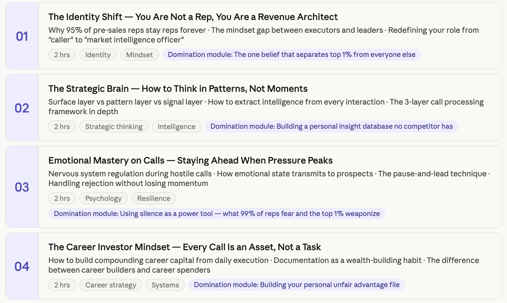

# Pre-sales

### Block A — Foundations (Control Mindset)

1. Pre-Sales as Decision Engineering
2. Buyer Psychology & Decision Triggers
3. ICP Definition & Market Segmentation
4. Funnel Mastery (TOFU–MOFU–BOFU with revenue mapping)

---

### Block B — Core Execution (Conversion Engine)

1. Discovery Mastery (Extracting Real Pain)
2. Problem Amplification (Creating Urgency)
3. Solution Framing (Outcome > Feature)
4. Objection Handling System (Price / Timing / Trust / Need)
5. Closing Systems (Forcing Decision)

---

### Block C — SDR / Appointment Setting

1. Outbound System Design (Cold → Meeting)
2. Messaging Engineering (Hooks, Sequences, Replies)
3. Appointment Setting Conversion (Meeting Quality Control)
4. No-Show Reduction & Calendar Optimization

---

### Block D — Pipeline & Revenue Control

1. Qualification Systems (Lead Scoring, Filtering)
2. Pipeline Math & Forecasting
3. CRM Mastery (Zoho / HubSpot as control system)

---

### Block E — Advanced Conversion Control

1. Call Intelligence & Pattern Extraction
2. Script Engineering & Iteration Systems
3. Conversion Optimization by Stage

---

### Block F — Strategic Leverage

1. Partnerships & Deal Flow Systems (B2B leverage engine)

---

**Mindset & Identity — The Inner Game**

**Pre-Sales Craft — Mastering the Core**

**SDR & Outbound Mastery**

**Partnerships & Appointment Setting**

**Strategic Intelligence & Transition Preparation**

