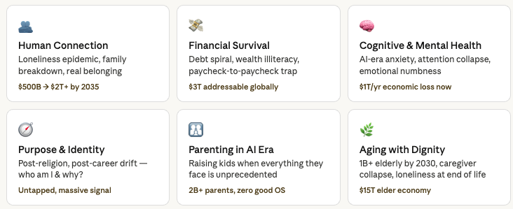

# Ideas

**Biggfam (human connection + family OS)** — this is your strongest idea. The loneliness economy is already projected to reach $500 billion, and it keeps growing because the problem it feeds on isn't getting better. [CV Observer](https://www.cvobserver.com/2026/04/02/the-loneliness-economy-why-remote-work-created-a-10-billion-industry-around-human-connection/) The Gujarat insight is genuinely valuable — you've seen a culture that solved distributed family cohesion, and nobody has productized that model. The gap isn't technology, it's wisdom turned into a system anyone can use.

**DPsychology (mental health + AI-era cognition)** — your framing about AI making average people "dumber and more anxious" is spot-on and underaddressed. Anxiety and depression alone cost the global economy around $1 trillion a year [Human Rights Careers](https://www.humanrightscareers.com/issues/current-global-issues/), and AI is accelerating the problem. Calm and Headspace do meditation. Nobody has built "cognitive fitness for the AI era" — preventing the decline before it happens.

**Personal Finance** — real problem, but the gap isn't the tool, it's the psychology. 47% of US adults still grade their personal finance knowledge C or worse [WalletHub](https://wallethub.com/edu/b/financial-literacy-statistics/25534). CRED and Mint exist, so your edge must be behavior change + emotional coaching, not tracking. If you combine this with Biggfam (family finances), you have a unique angle.

**Dating & Companion** — in the US, a surprising number of Gen Zers now say their closest confidants are apps, not people [Psychology Today](https://www.psychologytoday.com/us/blog/raising-resilient-children/202510/welcome-to-the-loneliness-economy). The market is real. But this space is brutal competitively and ethically complicated. Better to integrate companionship into Biggfam than build standalone.

**Sleep is the #1 overlooked opportunity.** Researchers estimate that insomnia sufferers would pay 14% of their income to get better sleep [RAND](https://www.rand.org/pubs/articles/2023/insomnia-the-multibillion-dollar-problem-sapping-world.html), and the annual economic cost of chronic insomnia ranges up to $207.5 billion in the US alone. [Rand](https://www.rand.org/news/press/2023/03/17.html) Yet the entire market is hardware (Oura, Whoop) and pills. Nobody owns the behavioral coaching layer — the psychology of why you can't sleep. This is a solopreneur-viable, high-WTP, underbuilt space.

**Immigrant life navigation is a massive blue ocean.** 300M international migrants globally, all navigating a new country's financial, legal, and cultural systems with zero integrated support. The WTP is extremely high because every wrong decision costs thousands. And this connects directly to your diaspora background — you have lived insight that no Silicon Valley team does.

**The overall framework now is clear:** the two criteria that matter most are (1) does the pain threaten income or survival, and (2) is there zero shame in paying? Sleep, career survival, debt, and immigrant navigation all score high on both. Loneliness and purpose fail the second test, which is why even massive pain doesn't convert to revenue.

### Newland

Vision:

Corridor

Pain to feature

Roadmap

Revenue

Viral Engine

Moat

Validate

India has the world's largest diaspora at 35.4 million people, and every year 2.5 million more Indians emigrate [Wikipedia](https://en.wikipedia.org/wiki/Indian_diaspora) — that's your incoming user base, year after year, automatically replenishing. In 2023 alone, India received $120 billion in remittances, nearly double Mexico's $66 billion [Indian Diaspora](https://www.indiandiaspora.org/news/global-footprint-indian-diaspora-worlds-largest-diaspora) — that single statistic tells you there's enormous financial flow happening through this community, and every dollar of it is an opportunity.

The corridor ranking is deliberate. UAE first because you're there, you understand it, and Indians make up nearly 40% of all immigrants in the UAE and a third of the country's population [Data For India](https://www.dataforindia.com/international-migration/) — the community density creates the fastest word-of-mouth. Canada second because the NRI population in Canada has seen an unprecedented rise, growing from 184,000 in 2015 to over 1.75 million in 2025 [FACTLY](https://factly.in/saudi-arabia-us-canada-and-gulf-nations-lead-growth-in-overseas-indian-population/) — that's a 10x surge creating an army of confused new arrivals with acute pain and money to spend. USA fourth despite being the largest market, because the green card backlog for Indians could reach over two million by 2030 and would take almost 195 years to clear [Theharvardpoliticalreview](https://theharvardpoliticalreview.com/america-green-card-backlog-indian-migrants/) — the complexity is enormous and requires more resources to serve well.

The single most important thing right now is the Validate tab. Don't touch code for 30 days. 30 interviews + a fake door landing page + 20 people who pay $10 = proof. Everything else is theory until then.